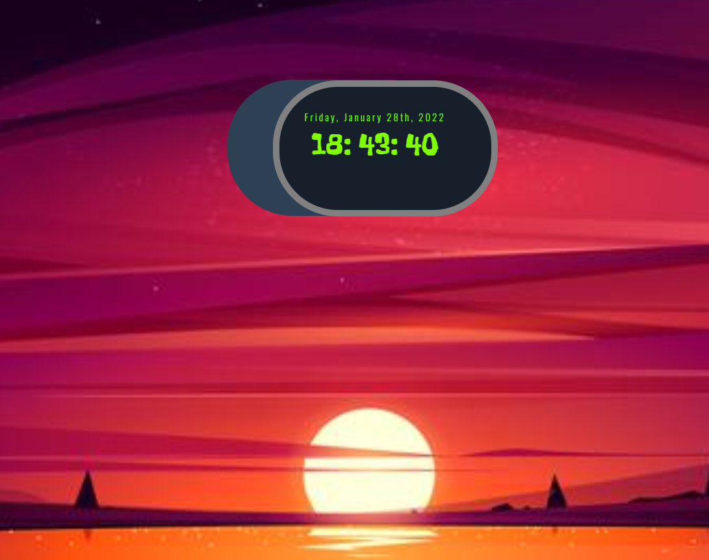

# Digital Clock

-   Digital clock with HTML, CSS and JavaScript.

---

_digital clock which changes the background image based on the time_

Hours Range:

```javascript
const backgroundImage = (time) => {
    let changeBackground = document.getElementById(`background`);
    const morning = `url(images/morning.png)`;
    const afternoon = `url(images/afternoon.png)`;
    const night = `url(images/night.png)`;
    const early_morning = `url(images/early-morning.png)`;

    return time >= 6 && time < 12
        ? (changeBackground.style.backgroundImage = morning)
        : time >= 12 && time < 19
        ? (changeBackground.style.backgroundImage = afternoon)
        : time >= 19 && time < 24
        ? (changeBackground.style.backgroundImage = night)
        : (changeBackground.style.backgroundImage = early_morning);
};
```

[DigitalClock-Web](https://simpleedigitalclock.netlify.app/ 'DigitalClock-Web')

<div style = 'text-align:center'>

</div>

[DigitalClock-Web](https://simpleedigitalclock.netlify.app/ 'DigitalClock-Web')
